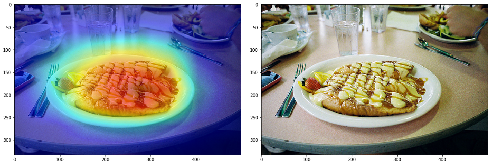

# Food Hunting with CNN

This script does two things:
* Outputs the probability of the input image containing food
* Localizes the food in the image

## Usage

`python findfood.py INPUT_IMAGE_FILENAME OUTPUT_IMAGE_FILENAME`

ex.
`python findfood.py ./bread.jpg ./breadout.jpg`

## Brief Technical Explanation
* By using Food-5K dataset [http://mmspg.epfl.ch/food-image-datasets], a food vs not-food model is trained by fine-tuning InceptionV3 in Keras
* [http://cnnlocalization.csail.mit.edu] The technique here is implemented for food localization. (Class Activation Mapping)

## Examples

